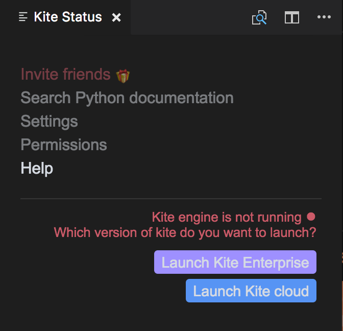

# Kite for Visual Studio Code

This extensions adds support for Kite in Visual Studio Code, including:

- Completion Lists
- Signature Help
- Quick Info
- Goto Definition 

## How to use this extension

This extension is automatically installed by Kite when you select Visual Studio Code in the list of plugins.

### Startup

When starting VSCode with Kite's plugin for the first time, the Kite's tour will be displayed in the active pane.

This tour will only be displayed once, if you want to see it again on next startup you can activate the `kite.showTourOnStartup` setting.

### Status Bar

The Kite icon in the status bar displays the state of Kite for the current file. By clicking on the icon you open the status panel with additional information.

The icon in the status bar can take three different colors:

- blue: The Kite Engine is available and functioning properly. 
- gray: There's either no open file or, if there's an active file, the file is either not supported or not whitelisted. 
- red: Something went wrong when the plugin tried to contact the Kite service on your computer. Depending on the issue, the status panel can offer actions to solve the problem. 

### Quick Info

You can see up to three links in the popup:

- `def` will open the file where this symbol is defined
- `web` will open the symbol documentation page in your browser
- `more` will open the [Kite expand view](#expand-view) with additional documentation for this symbol

### Expand View

The Kite expand view offer a more detailed view of a symbol documentation. You can use the sidebar panel to browse the members of a module or a type, or to access curated examples, Stack Overflow topics, and more.

### Active Search

Kite's active search is available using the corresponding command from the command palette. It will open the search panel on the side.

Type a module, function or symbol name and browse the results documentation in the panel.

### Commands

|Name|Description|
|---|---|
|`Kite Active Search`|Opens Kite's active search panel on the side.|

### Settings

|Name|Description|
|---|---|
|`kite.showTourOnStartup`|Whether to show the Kite tour on startup or not.|
|`kite.pollingInterval`|At which interval the status of the connexion to kite is checked by the extension, defaults to 5s.|